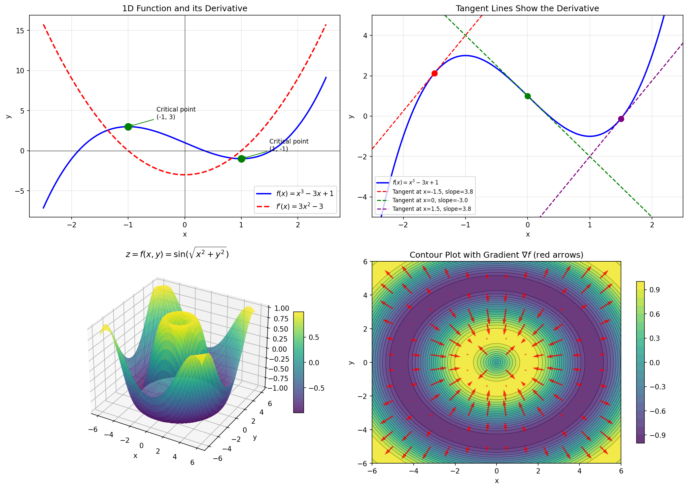
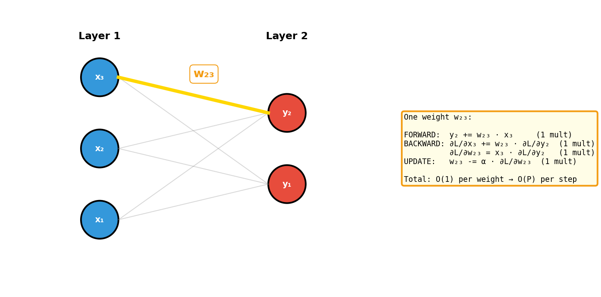
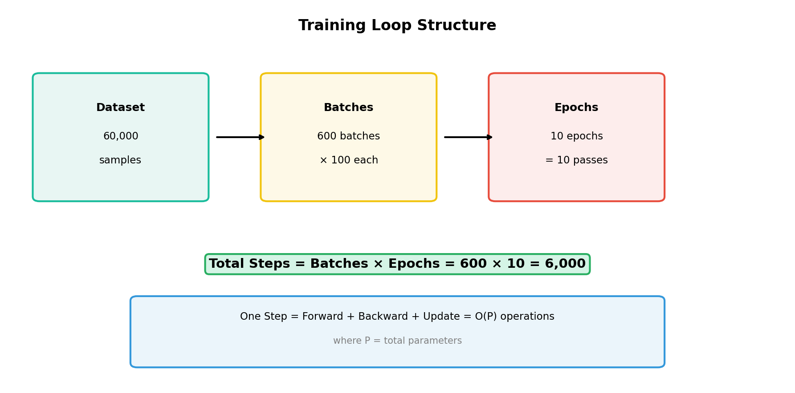
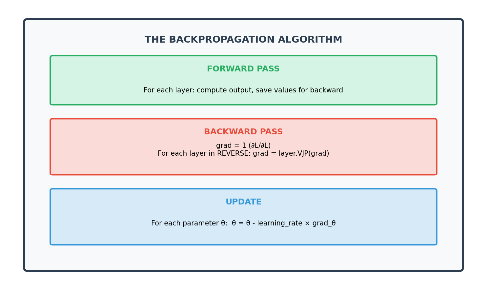
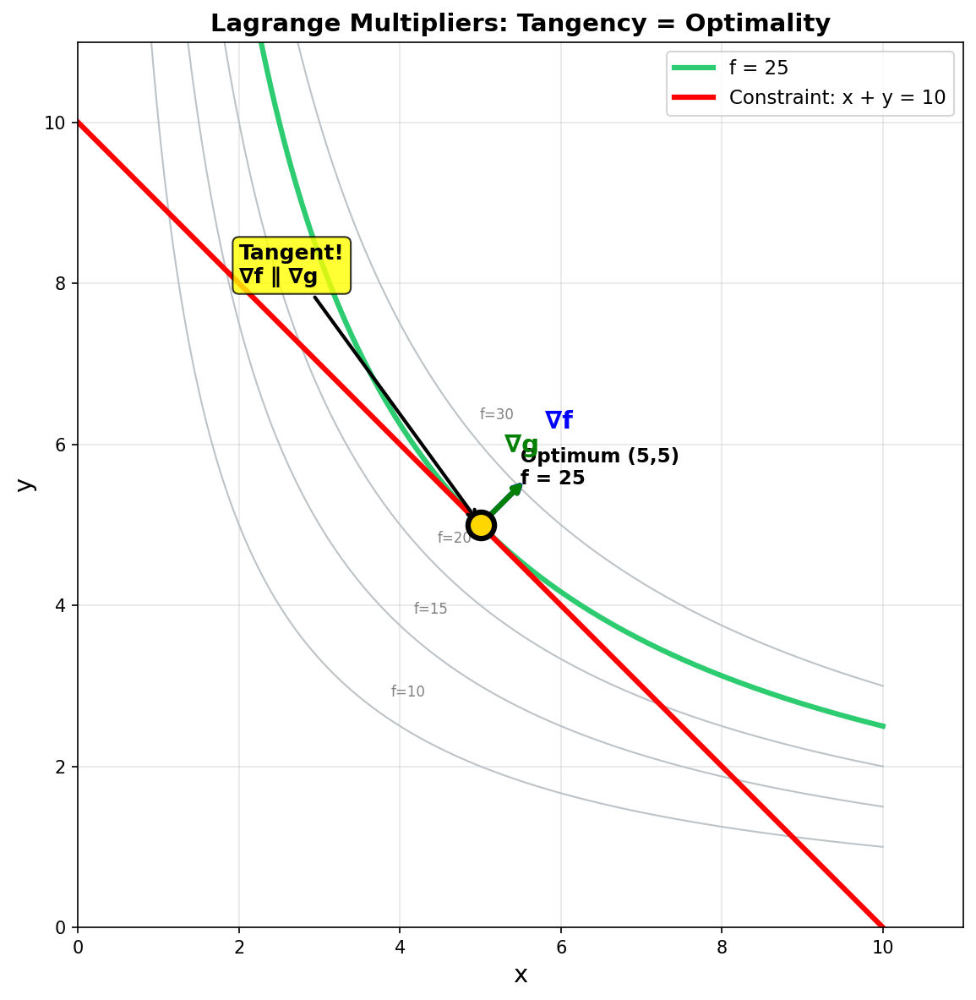
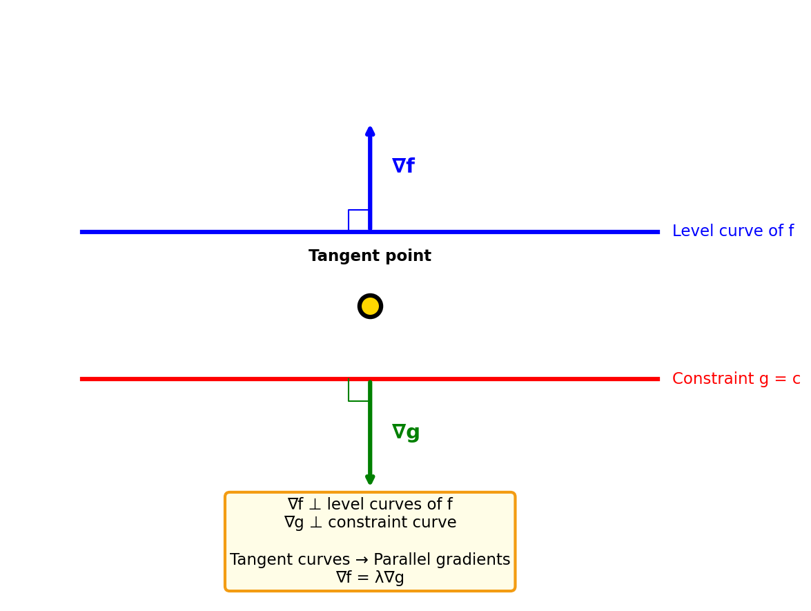
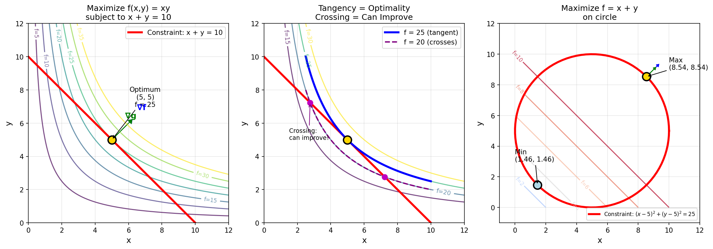
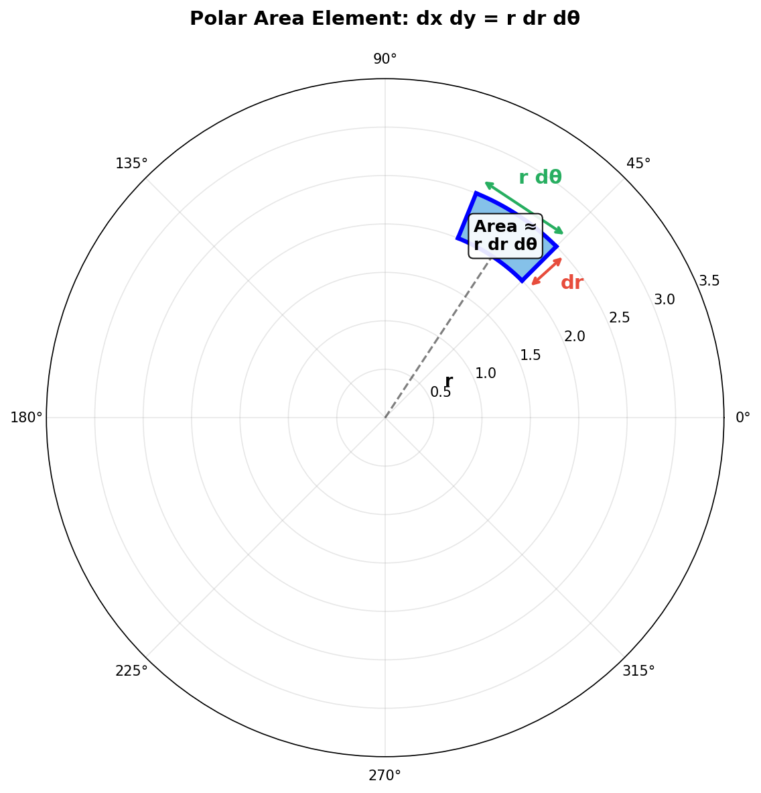
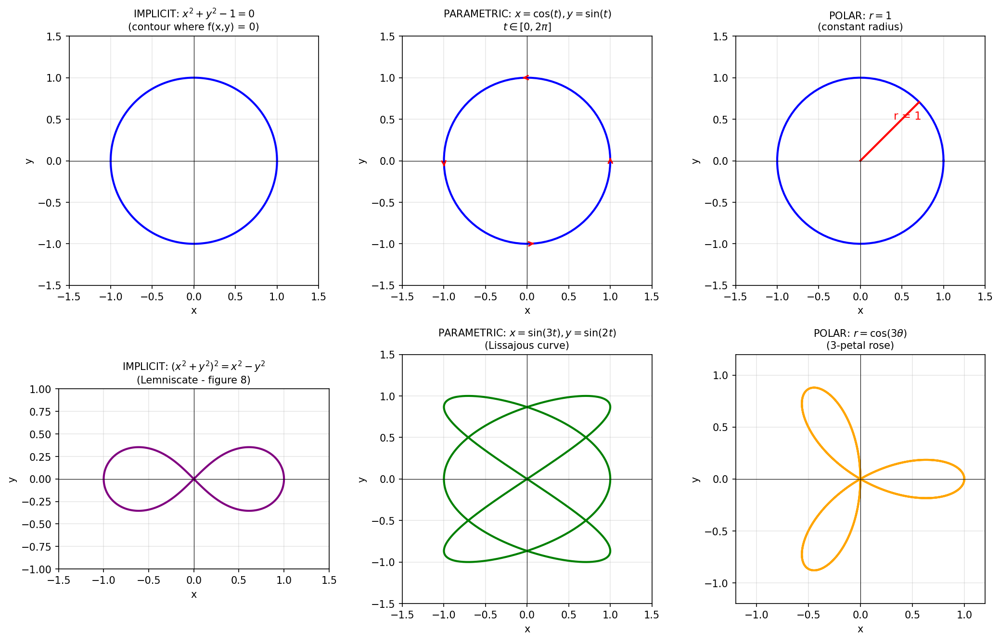
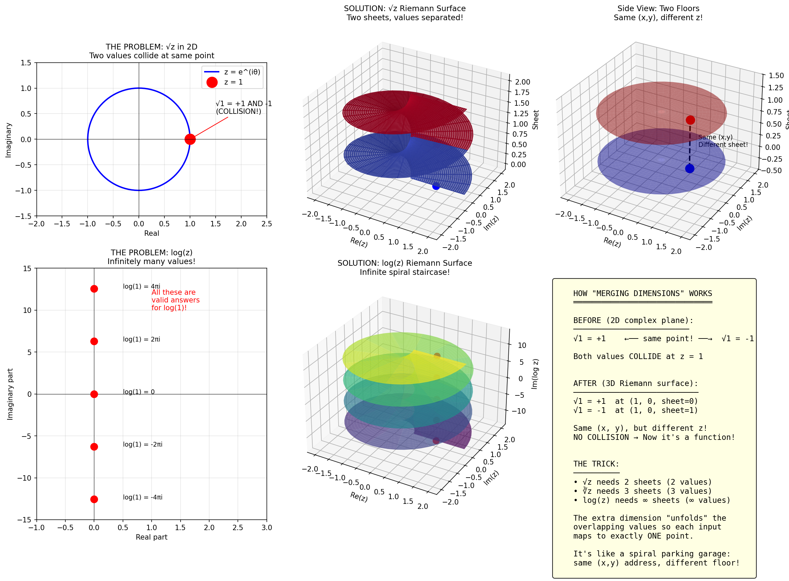

# Calculus

## Table of Contents

1. [Single Variable Functions](#1-single-variable-functions)
2. [Multivariable Functions & Gradients](#2-multivariable-functions--gradients)
3. [Jacobians, Gradient Flow & Backpropagation](#3-jacobians-gradient-flow--backpropagation)
4. [Lagrange Multipliers & Change of Variables](#4-lagrange-multipliers--change-of-variables)
5. [Curves That Aren't Functions](#5-curves-that-arent-functions)
6. [What Makes a Function a Function?](#6-what-makes-a-function-a-function)
7. [Multi-valued Functions & Riemann Surfaces](#7-multi-valued-functions--riemann-surfaces)
8. [Complex Numbers in Quantum Mechanics](#8-complex-numbers-in-quantum-mechanics)
9. [Euler's Formula](#9-eulers-formula)
10. [Quaternions & Non-commutativity](#10-quaternions--non-commutativity)
11. [Physics Intuition & Philosophy](#11-physics-intuition--philosophy)
12. [Abstract Algebra: Groups, Rings & Fields](#12-abstract-algebra-groups-rings--fields)
13. [Lean Formalization](#13-lean-formalization)

## 1. Single Variable Functions

### The Basic Setup

A function $y = f(x)$ maps each input $x$ to exactly one output $y$.

**Example:** $f(x) = x^3 - 3x + 1$

**Derivative:** $f'(x) = 3x^2 - 3$

The derivative tells us:

- Slope of the tangent line at any point
- Rate of change of $y$ with respect to $x$
- Where $f'(x) = 0$ → critical points (local max/min)

### Visualization



_Top left: Blue curve shows $f(x) = x^3 - 3x + 1$, red dashed line shows its derivative $f'(x) = 3x^2 - 3$. Green dots mark critical points where the derivative equals zero._

```lean
import Mathlib.Analysis.Calculus.Deriv.Basic
import Mathlib.Analysis.Calculus.Deriv.Pow

-- Define our function f(x) = x³ - 3x + 1
def f (x : ℝ) : ℝ := x^3 - 3*x + 1

-- The derivative f'(x) = 3x² - 3
def f' (x : ℝ) : ℝ := 3*x^2 - 3

-- Critical points occur where f'(x) = 0
-- 3x² - 3 = 0  →  x² = 1  →  x = ±1
def criticalPoints : Set ℝ := {x | f' x = 0}

-- We can prove: criticalPoints = {-1, 1}
example : criticalPoints = {-1, 1} := by
  ext x
  simp [criticalPoints, f']
  constructor
  · intro h
    have : x^2 = 1 := by linarith
    have : x = 1 ∨ x = -1 := sq_eq_one_iff.mp this
    tauto
  · intro h
    cases h <;> simp [*]
```

## 2. Multivariable Functions & Gradients

### From 1D to 2D

A function $z = f(x, y)$ maps each point $(x, y)$ to exactly one value $z$. This creates a **surface** in 3D space.

**Example:** $f(x, y) = \sin\left(\sqrt{x^2 + y^2}\right)$

### The Gradient

The gradient $\nabla f$ generalizes the derivative to multiple dimensions:

$$\nabla f = \left[ \frac{\partial f}{\partial x}, \frac{\partial f}{\partial y} \right]$$

For our example:

$$\frac{\partial f}{\partial x} = \cos\left(\sqrt{x^2 + y^2}\right) \cdot \frac{x}{\sqrt{x^2 + y^2}}$$

$$\frac{\partial f}{\partial y} = \cos\left(\sqrt{x^2 + y^2}\right) \cdot \frac{y}{\sqrt{x^2 + y^2}}$$

### What the Gradient Tells Us

| Property         | Meaning                           |
| ---------------- | --------------------------------- |
| Direction        | Points toward **steepest ascent** |
| Magnitude        | Rate of change in that direction  |
| Perpendicular to | Contour lines (level sets)        |

### Key Insight for Machine Learning

In ML, we minimize a loss function $L(\theta)$. Gradient descent update rule:

$$\theta_{\text{new}} = \theta_{\text{old}} - \alpha \cdot \nabla L(\theta)$$

The gradient points "uphill" — we go **opposite** direction to minimize.

### Visualization


_Bottom right: Contour plot with red arrows showing the gradient field. Notice arrows point perpendicular to contour lines and toward increasing values._

```lean
import Mathlib.Analysis.Calculus.Gradient.Basic

-- For a differentiable function f : ℝ × ℝ → ℝ
-- The gradient at a point (x, y) is the vector of partial derivatives

-- Gradient descent step
def gradientDescentStep (f : ℝ × ℝ → ℝ) (α : ℝ) (θ : ℝ × ℝ) (grad : ℝ × ℝ) : ℝ × ℝ :=
  (θ.1 - α * grad.1, θ.2 - α * grad.2)

-- The key theorem: gradient points in direction of steepest ascent
-- This is formalized in Mathlib as `HasGradientAt`
```

## 3. Jacobians, Gradient Flow & Backpropagation

### From Gradients to Jacobians

The gradient handles functions with **one output**. But what about functions with **multiple outputs**?

| Function | Input | Output | Derivative |
|----------|-------|--------|------------|
| $f: \mathbb{R} \to \mathbb{R}$ | scalar | scalar | $f'(x)$ — scalar |
| $f: \mathbb{R}^n \to \mathbb{R}$ | vector | scalar | $\nabla f$ — vector $(1 \times n)$ |
| $f: \mathbb{R}^n \to \mathbb{R}^m$ | vector | vector | $J$ — matrix $(m \times n)$ |

### What Is a Jacobian?

The Jacobian captures "how every output depends on every input."

For $f: \mathbb{R}^2 \to \mathbb{R}^3$ (2 inputs, 3 outputs):

$$J_f = \begin{pmatrix} \frac{\partial f_1}{\partial x_1} & \frac{\partial f_1}{\partial x_2} \\ \frac{\partial f_2}{\partial x_1} & \frac{\partial f_2}{\partial x_2} \\ \frac{\partial f_3}{\partial x_1} & \frac{\partial f_3}{\partial x_2} \end{pmatrix}$$

- Each **row** = how one output depends on all inputs
- Each **column** = how all outputs depend on one input

**Example:**

$$f(x, y) = \begin{pmatrix} x^2 + y \\ xy \\ \sin(x) \end{pmatrix}$$

$$J_f = \begin{pmatrix} 2x & 1 \\ y & x \\ \cos(x) & 0 \end{pmatrix}$$

### The Chain Rule with Jacobians

For a composition $x \to h \to y \to L$:

$$\frac{\partial L}{\partial x} = \frac{\partial L}{\partial y} \cdot J_g \cdot J_f$$

This is just matrix multiplication! The chain rule becomes:

$$\underbrace{(1 \times n)}_{\partial L/\partial x} = \underbrace{(1 \times k)}_{\partial L/\partial y} \cdot \underbrace{(k \times m)}_{J_g} \cdot \underbrace{(m \times n)}_{J_f}$$

### Gradient Flow: A Concrete Example

Consider this computation:

```
INPUT          LAYER 1           LAYER 2         OUTPUT
(x, y)    →     (u, v)      →       P
 2 dim          2 dim            scalar
```

With:
- $u = x^2 + y$
- $v = xy$
- $P = u^2 + 3v$

**Forward pass** at $(x, y) = (1, 2)$:

```
u = 1² + 2 = 3
v = 1 × 2 = 2
P = 3² + 3×2 = 15
```

**Backward pass** — gradients flow from output to input:

**Step 1:** Gradient at output

$$\frac{\partial P}{\partial u} = 2u = 6, \quad \frac{\partial P}{\partial v} = 3$$

$$\frac{\partial P}{\partial (u,v)} = \begin{pmatrix} 6 & 3 \end{pmatrix}$$

**Step 2:** Jacobian of layer 1

$$J_f = \begin{pmatrix} \frac{\partial u}{\partial x} & \frac{\partial u}{\partial y} \\ \frac{\partial v}{\partial x} & \frac{\partial v}{\partial y} \end{pmatrix} = \begin{pmatrix} 2x & 1 \\ y & x \end{pmatrix} = \begin{pmatrix} 2 & 1 \\ 2 & 1 \end{pmatrix}$$

**Step 3:** Multiply (this IS backprop)

$$\frac{\partial P}{\partial (x,y)} = \begin{pmatrix} 6 & 3 \end{pmatrix} \begin{pmatrix} 2 & 1 \\ 2 & 1 \end{pmatrix} = \begin{pmatrix} 18 & 9 \end{pmatrix}$$

**Result:** $\frac{\partial P}{\partial x} = 18$, $\frac{\partial P}{\partial y} = 9$

### Visualizing the Flow


_Values flow forward through the network. Gradients flow backward, each layer applying its VJP._

Each step backward:

$$(incoming\ gradient) \times (Jacobian) = (outgoing\ gradient)$$

### Why We Don't Build Full Jacobians: The VJP

**The Problem:** In real networks, Jacobians are enormous.

```
Layer: 10,000 inputs → 10,000 outputs
Jacobian: 10,000 × 10,000 = 100,000,000 entries
```

**The Insight:** We never need the full Jacobian. Look at what we compute:

$$\frac{\partial L}{\partial h} = \frac{\partial L}{\partial y} \cdot J$$

It's always: $(row\ vector) \times (matrix) = (row\ vector)$

We only need the **product**, not the matrix itself.

### Vector-Jacobian Product (VJP)

**VJP:** Given incoming gradient $v$ and function $f$ with Jacobian $J$, compute $v \cdot J$ **without forming $J$**.

**Example — ReLU:** $y = \max(0, x)$ elementwise

Full Jacobian: $n \times n$ diagonal matrix (huge!)

$$J = \begin{pmatrix} d_1 & 0 & \cdots \\ 0 & d_2 & \cdots \\ \vdots & & \ddots \end{pmatrix} \quad \text{where } d_i = \begin{cases} 1 & x_i > 0 \\ 0 & \text{otherwise} \end{cases}$$

VJP: Just $n$ multiplications!

```
grad_x = grad_y * (x > 0)
```

### VJP Rules for Common Operations

| Forward | Backward (VJP) |
|---------|---------------|
| $y = x + c$ | $\nabla_x = \nabla_y$ |
| $y = x \cdot c$ | $\nabla_x = \nabla_y \cdot c$ |
| $y = a + b$ | $\nabla_a = \nabla_y$, $\nabla_b = \nabla_y$ |
| $y = a \cdot b$ | $\nabla_a = \nabla_y \cdot b$, $\nabla_b = \nabla_y \cdot a$ |
| $y = x^n$ | $\nabla_x = \nabla_y \cdot n \cdot x^{n-1}$ |
| $y = \sin(x)$ | $\nabla_x = \nabla_y \cdot \cos(x)$ |
| $y = e^x$ | $\nabla_x = \nabla_y \cdot e^x$ |
| $y = Wx$ | $\nabla_x = W^T \nabla_y$, $\nabla_W = \nabla_y \otimes x$ |
| $y = \text{ReLU}(x)$ | $\nabla_x = \nabla_y \odot (x > 0)$ |
| $y = \text{sum}(x)$ | $\nabla_x = [\nabla_y, \nabla_y, \ldots]$ |

### How Autograd Works

**Forward pass:** Build computation graph, save intermediate values

```python
x = tensor([1.0, 2.0], requires_grad=True)
u = x ** 2        # Records: "I squared x", saves x
v = u.sum()       # Records: "I summed u", saves u
```

**Backward pass:** Traverse graph in reverse, apply VJPs

```python
v.backward()
# grad_v = 1
# grad_u = VJP_sum(grad_v) = [1, 1]
# grad_x = VJP_square(grad_u) = [1, 1] * 2 * [1, 2] = [2, 4]
print(x.grad)  # tensor([2., 4.])
```

Each node only knows its own VJP — it doesn't know the rest of the network.

### Why This Is Efficient

**Naive (form full Jacobians):**
- Storage: $O(n^2)$ per layer
- Compute: $O(n^3)$ for matrix multiply

**VJP approach:**
- Storage: $O(n)$ — just the gradient vector
- Compute: $O(n)$ per layer, $O(kn)$ for $k$ layers

The gradient is always a vector, never a matrix.

### True Complexity: O(Parameters) Per Step

Each weight in the network does **O(1)** work:



_Each weight participates in exactly one multiply per phase (forward, backward, update). Total work scales with number of parameters._

**Total work per step = O(total parameters) = O(P)**

For a fully connected network with $k$ layers of size $n$: $P = kn^2$, so $O(kn^2)$ per step.

### Why VJP Works: Exploiting Structure

VJP isn't magic — it exploits **structure** in Jacobians.

**Case 1: No structure (dense Jacobian)**

If $J$ is completely dense with no pattern, you must touch every entry:

$$\text{VJP cost} = O(mn) \quad \text{— no savings}$$

**Case 2: ReLU — Diagonal Jacobian**

$$J = \begin{pmatrix} d_1 & 0 & 0 \\ 0 & d_2 & 0 \\ 0 & 0 & d_3 \end{pmatrix} \quad \text{where } d_i = \mathbf{1}_{x_i > 0}$$

For $n = 1000$: matrix has $10^6$ entries, but only $1000$ non-zeros.

| Approach | Storage | Compute |
|----------|---------|---------|
| Naive (dense J) | $10^6$ | $10^6$ |
| VJP (exploit diagonal) | $10^3$ | $10^3$ |

**Case 3: Matrix multiply y = Wx**

The Jacobian $\partial y / \partial x = W$ — already stored from forward pass!

The Jacobian $\partial y / \partial W$ would be an $(m \times m \cdot n)$ tensor if materialized.

But VJP gives: $\partial L / \partial W = v \otimes x$ — just $O(mn)$ via outer product.

| Operation | Jacobian Structure | VJP Exploits |
|-----------|-------------------|--------------|
| ReLU, sigmoid | Diagonal | $O(n)$ not $O(n^2)$ |
| Add | Identity | Just copy |
| Elementwise multiply | Diagonal | $O(n)$ |
| MatMul ($y = Wx$) | $J = W$ | Already stored |
| Sum | Row of ones | Broadcast |

### Training Loop: Epochs, Batches, Steps

**The vocabulary:**

| Term | Meaning |
|------|---------|
| **Batch** | Chunk of data processed together (e.g., 64 images) |
| **Step** | One forward + backward + update on one batch |
| **Epoch** | One full pass through entire dataset |

**Example:**



_Dataset is split into batches. Each epoch processes all batches. Total steps = batches × epochs._

**Why batches?**

| Batch Size | Tradeoff |
|------------|----------|
| 1 (pure SGD) | Noisy gradient, fast per step, escapes local minima |
| Full dataset | Perfect gradient, huge memory, gets stuck |
| 32-256 (typical) | Good tradeoff, fits GPU memory |

**Full training complexity:**

$$O(P \times \text{epochs} \times \text{batches\_per\_epoch}) = O(P \times \text{steps})$$

**The key insight:** Backprop costs ~2-3× forward pass. Computing gradients is essentially free compared to forming full Jacobians.

### Column vs Row Vectors

**Convention:** We use column vectors in math/ML because:

1. Function composition reads naturally: $y = CBAx$
2. Matrix columns show where basis vectors go
3. Gradient descent is clean: $\theta_{new} = \theta_{old} - \alpha \nabla L$

**But:** Gradients are technically row vectors (covectors). The VJP is:

$$(row\ vector) \times (Jacobian) = (row\ vector)$$

We transpose at the end for the update step.

```lean
import Mathlib.Analysis.Calculus.FDeriv.Basic
import Mathlib.Analysis.Calculus.FDeriv.Comp

-- The Fréchet derivative generalizes the Jacobian
-- For f : E → F, the derivative at x is a continuous linear map E →L[𝕜] F

-- Chain rule for Fréchet derivatives
#check HasFDerivAt.comp
-- If g has derivative g' at f(x), and f has derivative f' at x,
-- then (g ∘ f) has derivative g' ∘ f' at x

-- For finite dimensions, this is Jacobian multiplication
example {f : ℝ × ℝ → ℝ × ℝ} {g : ℝ × ℝ → ℝ} {x : ℝ × ℝ}
    {f' : ℝ × ℝ →L[ℝ] ℝ × ℝ} {g' : ℝ × ℝ →L[ℝ] ℝ}
    (hf : HasFDerivAt f f' x) (hg : HasFDerivAt g g' (f x)) :
    HasFDerivAt (g ∘ f) (g'.comp f') x :=
  hg.comp x hf
```

### Summary: The Backpropagation Algorithm



_The three phases of each training step: forward pass computes values, backward pass computes gradients via VJPs, update step adjusts parameters._

## 4. Lagrange Multipliers & Change of Variables

### Constrained Optimization: The Problem

Maximize (or minimize) $f(x, y)$ subject to constraint $g(x, y) = c$

**Example:** Maximize $f(x,y) = xy$ subject to $x + y = 10$

### The Geometric Insight

Think about level curves:
- Level curves of $f$: sets where $f(x,y) = k$ for various $k$
- Constraint curve: where $g(x,y) = c$

**Question:** What's the largest level curve of $f$ that still touches $g = c$?

**Answer:** The one that's **tangent** to the constraint.



_At the optimum, the level curve of f (green, f=25) is tangent to the constraint (red line). The gradients ∇f and ∇g point in the same direction._

If $f$'s level curve **crosses** $g = c$, you can slide along the constraint and increase $f$.

At tangency, you **can't improve** — that's the extremum.

### Tangency Means Parallel Gradients

At any point:
- $\nabla f$ is perpendicular to level curves of $f$
- $\nabla g$ is perpendicular to the constraint curve $g = c$

**If the curves are tangent, their normals are parallel:**

$$\nabla f = \lambda \nabla g$$

for some scalar $\lambda$ (the Lagrange multiplier).



_At the optimum, both gradients point in the same (or opposite) direction. This is the Lagrange condition: ∇f = λ∇g._

### The Method

Solve the system:

$$\nabla f = \lambda \nabla g$$
$$g(x, y) = c$$

**Example:** Maximize $f(x,y) = xy$ subject to $x + y = 10$

$$\frac{\partial f}{\partial x} = y = \lambda \cdot 1$$
$$\frac{\partial f}{\partial y} = x = \lambda \cdot 1$$
$$x + y = 10$$

From first two: $x = y = \lambda$. Substitute: $2\lambda = 10 \Rightarrow \lambda = 5$

**Solution:** $x = y = 5$, maximum is $f = 25$

### Visualization



_Level curves of $f(x,y) = xy$ shown as contours. The constraint $x + y = 10$ is the straight line. At the optimum $(5, 5)$, the level curve is tangent to the constraint, and $\nabla f \parallel \nabla g$._

### What λ Means

The multiplier $\lambda$ has a physical interpretation:

$$\lambda = \frac{df^*}{dc}$$

where $f^*$ is the optimal value. It measures **sensitivity**: how much the optimum changes if we relax the constraint.

In our example: $\lambda = 5$ means if we change the constraint to $x + y = 11$, the maximum increases by approximately $5$.

---

### Change of Variables: The Jacobian Determinant

When changing variables in integration:

$$\iint f(x,y)\,dx\,dy = \iint f(x(u,v), y(u,v)) \cdot |\det J|\,du\,dv$$

where:

$$J = \begin{pmatrix} \frac{\partial x}{\partial u} & \frac{\partial x}{\partial v} \\ \frac{\partial y}{\partial u} & \frac{\partial y}{\partial v} \end{pmatrix}$$

### Why |det J|?

A small rectangle in $(u, v)$ space maps to a **parallelogram** in $(x, y)$ space.


_A small rectangle in (u, v) space maps to a parallelogram in (x, y) space. The area scaling factor is |det J|._

**The parallelogram's sides:**

Moving in $u$ direction: $\vec{a} = \begin{pmatrix} \partial x/\partial u \\ \partial y/\partial u \end{pmatrix} du$

Moving in $v$ direction: $\vec{b} = \begin{pmatrix} \partial x/\partial v \\ \partial y/\partial v \end{pmatrix} dv$

**Area of parallelogram** = $|a_1 b_2 - a_2 b_1|$ = $|\det J| \, du \, dv$

### Example: Polar Coordinates

$$x = r\cos\theta, \quad y = r\sin\theta$$

$$J = \begin{pmatrix} \cos\theta & -r\sin\theta \\ \sin\theta & r\cos\theta \end{pmatrix}$$

$$\det J = r\cos^2\theta + r\sin^2\theta = r$$

Therefore: $dx\,dy = r\,dr\,d\theta$

**Geometric meaning:** A box $dr \times d\theta$ maps to a curved rectangle with area $\approx r \cdot dr \cdot d\theta$



_In polar coordinates, a small box dr × dθ maps to a curved rectangle with area ≈ r · dr · dθ._

### Connection to Jacobians in ML

| Context | Jacobian Role |
|---------|--------------|
| **Integration** | $\|det J\|$ = area scaling factor |
| **Backprop** | $J$ = how outputs depend on inputs |
| **Normalizing flows** | $\|det J\|$ = density transformation |

In normalizing flows (generative models), we transform a simple distribution through invertible layers, tracking density via:

$$p_Y(y) = p_X(x) \cdot |\det J^{-1}|$$

```lean
import Mathlib.Analysis.Calculus.LagrangeMultipliers

-- Lagrange multiplier theorem exists in Mathlib
-- At a constrained extremum, gradients are parallel

-- For change of variables, the key theorem is:
-- ∫∫ f(x,y) dx dy = ∫∫ f(g(u,v)) |det Dg| du dv
-- where Dg is the Jacobian matrix of g
```

## 5. Curves That Aren't Functions

### The Problem

A circle $x^2 + y^2 = 1$ **cannot** be written as $y = f(x)$.

Why? At $x = 0$:
$$y^2 = 1 \implies y = +1 \text{ or } y = -1$$

One input, two outputs → **not a function**.

### Three Ways to Represent Curves

#### Method 1: Implicit Form $f(x, y) = 0$

$$x^2 + y^2 - 1 = 0 \quad \text{(circle)}$$

$$\frac{x^2}{a^2} + \frac{y^2}{b^2} - 1 = 0 \quad \text{(ellipse)}$$

$$(x^2 + y^2)^2 = x^2 - y^2 \quad \text{(lemniscate)}$$

#### Method 2: Parametric Form $x(t), y(t)$

$$x = \cos(t), \quad y = \sin(t), \quad t \in [0, 2\pi] \quad \text{(circle)}$$

$$x = a\cos(t), \quad y = b\sin(t) \quad \text{(ellipse)}$$

$$x = \sin(3t), \quad y = \sin(2t) \quad \text{(Lissajous curve)}$$

#### Method 3: Polar Form $r = f(\theta)$

$$r = 1 \quad \text{(circle)}$$

$$r = 1 + \cos(\theta) \quad \text{(cardioid)}$$

$$r = \cos(3\theta) \quad \text{(3-petal rose)}$$

### Visualization



_Top row: Three ways to represent a circle. Bottom row: Lemniscate (implicit), Lissajous (parametric), and rose curve (polar)._

### Derivatives for These Curves

**Parametric:**
$$\frac{dy}{dx} = \frac{dy/dt}{dx/dt}$$

**Implicit** (using chain rule):
$$\frac{dy}{dx} = -\frac{\partial f/\partial x}{\partial f/\partial y}$$

**Polar:**
$$\frac{dy}{dx} = \frac{r'\sin\theta + r\cos\theta}{r'\cos\theta - r\sin\theta}$$

```lean
import Mathlib.Analysis.SpecialFunctions.Trigonometric.Basic

-- Parametric circle
def circleParametric (t : ℝ) : ℝ × ℝ := (Real.cos t, Real.sin t)

-- Verify it satisfies x² + y² = 1
theorem circle_satisfies_equation (t : ℝ) :
    let (x, y) := circleParametric t
    x^2 + y^2 = 1 := by
  simp [circleParametric]
  exact Real.cos_sq_add_sin_sq t

-- Implicit circle predicate
def onUnitCircle (p : ℝ × ℝ) : Prop := p.1^2 + p.2^2 = 1
```

## 6. What Makes a Function a Function?

### The One Rule

> **Each input must map to exactly ONE output.**

| Allowed                                  | Not Allowed                             |
| ---------------------------------------- | --------------------------------------- |
| $f(2) = 4$ and $f(-2) = 4$ (many-to-one) | $f(2) = 4$ and $f(2) = 7$ (one-to-many) |

### Terminology

| Term                       | Meaning                              | Example                                          |
| -------------------------- | ------------------------------------ | ------------------------------------------------ |
| **Injective** (one-to-one) | Different inputs → different outputs | $f(x) = 2x + 1$                                  |
| **Surjective** (onto)      | Every output is hit by some input    | $f(x) = x^3$ over $\mathbb{R} \to \mathbb{R}$    |
| **Bijective**              | Both injective and surjective        | $f(x) = 2x + 1$ over $\mathbb{R} \to \mathbb{R}$ |

### Why This Definition?

It's a **choice** we made because it's useful:

1. **Determinism** — Given input, compute exactly one answer
2. **Calculus works** — Derivatives ask "how does $y$ change?" — meaningless if $y$ is ambiguous
3. **Composition works** — $f(g(x))$ needs $g(x)$ to produce one value

```lean
-- Lean's definition of Function.Injective
#check Function.Injective
-- Function.Injective f ↔ ∀ a₁ a₂, f a₁ = f a₂ → a₁ = a₂

-- Function.Surjective
#check Function.Surjective
-- Function.Surjective f ↔ ∀ b, ∃ a, f a = b

-- Function.Bijective
#check Function.Bijective
-- Function.Bijective f ↔ Injective f ∧ Surjective f

-- Example: f(x) = 2x + 1 is injective
example : Function.Injective (fun x : ℝ => 2*x + 1) := by
  intro a b h
  linarith
```

## 7. Multi-valued Functions & Riemann Surfaces

### The Contradiction

"Multi-valued function" is an oxymoron. If a function must be single-valued, how can there be multi-valued functions?

**Answer:** It's a linguistic hack. They're really:

1. **Relations** (not functions)
2. **Set-valued maps** — $f(4) = \{-2, +2\}$
3. **Functions on a different domain** (Riemann surfaces)

### The Problem with $\sqrt{z}$

For complex $z = 1$:
$$\sqrt{1} = +1 \text{ and } -1$$

Both values "collide" at the same point $z = 1$.

### The Riemann Surface Solution

Add an extra dimension to separate the colliding values.

Imagine two sheets of paper (complex planes) stacked on top of each other, connected with a twist:

- **Sheet 1:** $\sqrt{1} = +1$
- **Sheet 2:** $\sqrt{1} = -1$

When you walk around the origin once, you move from Sheet 1 to Sheet 2. Walk around again, back to Sheet 1.

**On this 2-sheeted surface, $\sqrt{z}$ is single-valued and continuous.**

### For $\log(z)$

Even worse: $\log(1) = 0, 2\pi i, 4\pi i, -2\pi i, \ldots$ (infinitely many values)

Solution: Infinite spiral staircase. Each "floor" is one value.

### Visualization



_Middle: Two-sheeted Riemann surface for $\sqrt{z}$. The blue and red sheets connect at the origin. Same $(x,y)$ coordinates, different "floor."_

### Why This Matters

On the Riemann surface, calculus works:

$$\frac{d}{dz}\sqrt{z} = \frac{1}{2\sqrt{z}}$$

$$\frac{d}{dz}\log(z) = \frac{1}{z}$$

No ambiguity because the function is now single-valued.

## 8. Complex Numbers in Quantum Mechanics

### The Unit Circle

Every point on the unit circle has $|z| = 1$.

In quantum mechanics: $|\text{amplitude}|^2 = \text{probability}$

So $|z| = 1 \implies |z|^2 = 1 = 100\%$ probability.

**The unit circle = all possible phases with the same probability.**

### The Four Key Points

$$1 = e^{i \cdot 0} \quad \text{(phase 0°)}$$
$$i = e^{i \cdot \pi/2} \quad \text{(phase 90°)}$$
$$-1 = e^{i \cdot \pi} \quad \text{(phase 180°)}$$
$$-i = e^{i \cdot 3\pi/2} \quad \text{(phase 270°)}$$

### Quantum States

A qubit: $|\psi\rangle = \alpha|0\rangle + \beta|1\rangle$ where $|\alpha|^2 + |\beta|^2 = 1$

Phase doesn't affect probability of ONE measurement:
$$|\alpha|^2 = |e^{i\theta}\alpha|^2$$

But phase DOES affect **interference**:

**Constructive:**
$$\frac{1}{\sqrt{2}} + \frac{1}{\sqrt{2}} = \sqrt{2}$$

**Destructive:**
$$\frac{1}{\sqrt{2}} + \frac{-1}{\sqrt{2}} = 0$$

### Why Complex Numbers?

Experiments have tested "real quantum mechanics" vs "complex quantum mechanics."

**Result: Nature requires complex numbers.**

Complex numbers are the **minimal structure** supporting:

- Waves (oscillation)
- Interference (addition with cancellation)
- Probability conservation (unit magnitude)

```lean
import Mathlib.Data.Complex.Basic
import Mathlib.Data.Complex.Exponential

-- The unit circle in ℂ
def unitCircle : Set ℂ := {z | Complex.abs z = 1}

-- e^(iθ) is on the unit circle
theorem exp_iθ_on_unit_circle (θ : ℝ) : Complex.exp (Complex.I * θ) ∈ unitCircle := by
  simp [unitCircle, Complex.abs_exp]

-- Key points on the unit circle
example : Complex.exp (Complex.I * 0) = 1 := by simp
example : Complex.exp (Complex.I * Real.pi) = -1 := Complex.exp_pi_mul_I
```

## 9. Euler's Formula

### The Formula

$$e^{i\theta} = \cos(\theta) + i\sin(\theta)$$

### Proof via Taylor Series

$$e^x = 1 + x + \frac{x^2}{2!} + \frac{x^3}{3!} + \frac{x^4}{4!} + \cdots$$

Substitute $x = i\theta$:

$$e^{i\theta} = 1 + i\theta + \frac{(i\theta)^2}{2!} + \frac{(i\theta)^3}{3!} + \frac{(i\theta)^4}{4!} + \cdots$$

Using $i^2 = -1$, $i^3 = -i$, $i^4 = 1$:

$$e^{i\theta} = \underbrace{\left(1 - \frac{\theta^2}{2!} + \frac{\theta^4}{4!} - \cdots\right)}_{\cos\theta} + i\underbrace{\left(\theta - \frac{\theta^3}{3!} + \frac{\theta^5}{5!} - \cdots\right)}_{\sin\theta}$$

### Proof via Differential Equations

Both $f(\theta) = e^{i\theta}$ and $g(\theta) = \cos\theta + i\sin\theta$ satisfy:

$$f'(\theta) = i \cdot f(\theta)$$

With $f(0) = 1$. Same ODE, same initial condition → same function.

### Euler's Identity

Set $\theta = \pi$:

$$e^{i\pi} = \cos(\pi) + i\sin(\pi) = -1$$

Therefore:

$$e^{i\pi} + 1 = 0$$

Five fundamental constants in one equation.

```lean
import Mathlib.Analysis.SpecialFunctions.Complex.Circle

-- Euler's formula is in Mathlib
#check Complex.exp_mul_I
-- Complex.exp (↑θ * I) = Complex.cos θ + Complex.sin θ * I

-- Euler's identity
theorem euler_identity : Complex.exp (Complex.I * Real.pi) + 1 = 0 := by
  rw [mul_comm, Complex.exp_pi_mul_I]
  ring
```

## 10. Quaternions & Non-commutativity

### What Are Quaternions?

$$q = a + bi + cj + dk$$

Where:
$$i^2 = j^2 = k^2 = -1$$

### The Non-commutativity

$$ij = k \quad \text{but} \quad ji = -k$$

$$ij \neq ji$$

Order matters!

### Concrete Example

$$(1 + i)(1 + j) = 1 + i + j + k$$
$$(1 + j)(1 + i) = 1 + i + j - k$$

Different answers.

### Why This Breaks Quantum Mechanics

**Problem 1: Phase factors must commute**

In QM, global phase is unobservable. But:

$$e^{i\alpha} \cdot e^{j\beta} \neq e^{j\beta} \cdot e^{i\alpha}$$

Now "global phase" depends on order → ambiguity.

**Problem 2: Tensor products break**

Two particles: $|\psi_A\rangle \otimes |\psi_B\rangle$

Which we label "first" shouldn't matter. Non-commutativity breaks this.

**Problem 3: Eigenvalues may not be real**

Observable quantities must be real. The proof requires commutativity.

### Geometric Meaning

- Complex numbers = 2D rotation (commutative)
- Quaternions = 3D rotation (non-commutative)

Try rotating your phone:

1. 90° forward, then 90° right → screen faces right
2. 90° right, then 90° forward → screen faces up

Different results!

```lean
import Mathlib.Algebra.Quaternion

-- Quaternion multiplication is not commutative
example : ∃ (a b : ℍ[ℝ]), a * b ≠ b * a := by
  use ⟨0, 1, 0, 0⟩, ⟨0, 0, 1, 0⟩  -- i and j
  simp [Quaternion.ext_iff]
  -- ij = k but ji = -k
  norm_num

-- But complex multiplication IS commutative
example (a b : ℂ) : a * b = b * a := mul_comm a b
```

## 11. Physics Intuition & Philosophy

### What Is "Physics Intuition"?

Often described as mysterious talent. But it's actually:

| Component               | What It Is                               |
| ----------------------- | ---------------------------------------- |
| **Epistemology**        | What can we know? What do concepts mean? |
| **Ontology**            | What exists? Is spacetime real?          |
| **Aesthetics**          | Simplicity, symmetry, beauty as guides   |
| **Pattern recognition** | Experience from working with systems     |

The first three are philosophy.

### Einstein's Approach

He wasn't a math prodigy. His strength was **philosophical questioning**:

- "What would I see if I rode alongside a light beam?"
- "Can you distinguish gravity from acceleration?"
- "What does 'simultaneous' actually mean?"

These aren't calculations. They're philosophical thought experiments.

Einstein read Hume, Mach, Kant, Spinoza. His biographer noted he had more philosophy than physics books.

### What Other Scientists Say

**Dirac:**

> "It is more important to have beauty in one's equations than to have them fit experiment."

**Heisenberg:**

> "Physics and philosophy are inseparable... The physicist who tries to avoid philosophical questions tends to become a bad philosopher."

**Weinberg:**

> "A physicist learns to feel the beauty of a theory... It's a horse sense developed by years of experience."

**Wigner** (on why math works):

> "The miracle of the appropriateness of mathematics for physics is a wonderful gift which we neither understand nor deserve."

**Poincaré:**

> "It is by logic that we prove, but by intuition that we discover."

### The "Taste" Concept

Many physicists use this word:

- Gell-Mann on Feynman: "exquisite taste in physics problems"
- Dyson: "Some have good taste, some bad. It cannot be taught."
- Yang: Choosing the right symmetry group is "a matter of taste that turned out to be correct"

### Implications

If intuition = philosophy + aesthetics + experience, you can develop it:

1. Read philosophy of science (Hume, Mach, Kuhn, Popper)
2. Study elegant proofs and theories
3. Practice solving problems
4. Question "obvious" assumptions

## 12. Abstract Algebra: Groups, Rings & Fields

### The Core Idea

These structures capture **what operations you can do and undo**.

| Structure | Operations | Key Property |
|-----------|------------|--------------|
| **Group** | One (∗) | Every action is reversible |
| **Ring** | Two (+, ×) | Addition invertible, multiplication maybe not |
| **Field** | Two (+, ×) | Both fully invertible (except ÷0) |

### Groups — Symmetry / Reversible Actions

A group has: closure, associativity, identity, and inverses.

**Intuition:** A group is a collection of **reversible actions**.

- ℤ under addition: add 3, undo by adding -3
- Rotations of a square: rotate 90°, undo by rotating 270°
- Rubik's cube moves: every sequence can be undone

**Why it matters:** Groups ARE symmetry. Noether's theorem: symmetries → conservation laws. Rotation symmetry → angular momentum conservation.

### Rings — Arithmetic Without Full Division

Two operations where addition forms a group, multiplication is associative and distributes, but multiplication might NOT have inverses.

**Intuition:** You can do arithmetic, but **division might not work**.

- ℤ: 3 × ? = 1 has no integer solution
- Polynomials: x × ? = 1 has no polynomial solution
- Matrices: not all matrices are invertible

### Fields — Complete Arithmetic

Both operations (excluding division by 0) have inverses. Normal algebra works.

**Examples:** ℚ, ℝ, ℂ, finite fields ℤ/pℤ

**Why it matters:** Fields are where linear algebra works, polynomials behave nicely, and you can "move things to the other side" of equations.

### Abelian vs Non-Abelian

**Abelian** (commutative): ab = ba — order doesn't matter
**Non-abelian**: ab ≠ ba — order matters

| Type | Examples |
|------|----------|
| Abelian | Integer addition, translations in space |
| Non-abelian | 3D rotations, Rubik's cube moves, Standard Model gauge group SU(3)×SU(2)×U(1) |

**Why it matters:** Abelian groups are "tame" and fully classified. Non-abelian groups encode richer structure — the non-commutativity carries information.

### The Number System Hierarchy

| System | Algebraically Closed? | Field? | Notes |
|--------|----------------------|--------|-------|
| ℕ | No | No (not even a ring) | x + 1 = 0 fails |
| ℤ | No | No (no mult. inverses) | 2x = 1 fails |
| ℚ | No | Yes | x² - 2 = 0 fails |
| ℝ | No | Yes | x² + 1 = 0 fails |
| ℂ | **Yes** | **Yes** | The sweet spot |
| ℍ | Has roots | No (non-commutative) | Loses field structure |
| 𝕆 | Complicated | No (non-associative) | Loses more structure |

**The Fundamental Theorem of Algebra:** Every polynomial over ℂ has a root in ℂ. This makes ℂ algebraically closed — you never need a larger system.

**Key theorems:**
- **Frobenius (1878):** The only finite-dimensional associative division algebras over ℝ are ℝ, ℂ, and ℍ
- **Hurwitz (1898):** The only normed division algebras are ℝ, ℂ, ℍ, 𝕆 (dimensions 1, 2, 4, 8)

### Why Abstract?

**Prove once, apply everywhere:** Lagrange's theorem (subgroup order divides group order) applies to symmetries of cubes, integers mod n, permutations — any finite group.

**See hidden connections:** ℤ and circle rotations seem unrelated, but both are "infinite cyclic" — structurally identical.

**Know what's possible:** Galois theory proves there's NO general formula for degree 5+ polynomials. Not "we haven't found one" — it's impossible.

### The Deep Intuition

- **Group:** "What transformations can I do and undo?"
- **Ring:** "What if I can combine things two ways but can't always un-multiply?"
- **Field:** "What if everything works — full equation manipulation?"
- **Abelian vs not:** "Does order of operations matter?"

The axioms aren't arbitrary rules — they're the **minimal assumptions** needed for certain types of reasoning to work.

## 13. Lean Formalization

### Why Lean?

Lean is a proof assistant that lets you:

- State mathematical definitions precisely
- Prove theorems with machine-checked proofs
- Build libraries of verified mathematics

### Setting Up

```bash
# Install elan (Lean version manager)
curl https://raw.githubusercontent.com/leanprover/elan/master/elan-init.sh -sSf | sh

# Create a new Mathlib project
lake new my_calculus math
cd my_calculus
lake update
lake build
```

### Core Concepts in Mathlib

```lean
import Mathlib

-- Real analysis
#check Real.cos
#check Real.sin
#check Real.exp
#check deriv  -- derivative

-- Complex analysis
#check Complex
#check Complex.exp
#check Complex.abs

-- Topology
#check IsOpen
#check Continuous

-- Functions
#check Function.Injective
#check Function.Surjective
#check Function.Bijective
```

### A Complete Example: Proving the Chain Rule

```lean
import Mathlib.Analysis.Calculus.Deriv.Comp

-- The chain rule: (f ∘ g)'(x) = f'(g(x)) · g'(x)

example {f g : ℝ → ℝ} {x : ℝ}
    (hf : DifferentiableAt ℝ f (g x))
    (hg : DifferentiableAt ℝ g x) :
    deriv (f ∘ g) x = deriv f (g x) * deriv g x :=
  deriv.comp x hf hg
```

### Formalizing Gradient Descent

```lean
import Mathlib.Analysis.InnerProductSpace.Basic

variable {n : ℕ}

-- A gradient descent step
def gdStep (α : ℝ) (∇f : Fin n → ℝ → ℝ) (θ : Fin n → ℝ) : Fin n → ℝ :=
  fun i => θ i - α * ∇f i (θ i)

-- Multiple steps
def gdSteps (α : ℝ) (∇f : Fin n → ℝ → ℝ) : ℕ → (Fin n → ℝ) → (Fin n → ℝ)
  | 0, θ => θ
  | k + 1, θ => gdSteps α ∇f k (gdStep α ∇f θ)
```

## Summary

| Topic                     | Key Insight                                                 |
| ------------------------- | ----------------------------------------------------------- |
| **Derivatives**           | Rate of change; slope of tangent                            |
| **Gradients**             | Direction of steepest ascent; basis of ML optimization      |
| **Jacobians**             | Matrix of partials for vector → vector functions            |
| **Backpropagation**       | Chain rule = multiply Jacobians backward                    |
| **VJPs**                  | Exploit Jacobian structure; compute $v \cdot J$ directly    |
| **Complexity**            | $O(P)$ per step where $P$ = parameters; backprop ≈ 2× forward |
| **Training loop**         | Steps = epochs × batches; batch size trades noise vs memory |
| **Lagrange multipliers**  | At constrained optimum, $\nabla f \parallel \nabla g$       |
| **Change of variables**   | $dx\,dy = \|\det J\| \, du\,dv$; Jacobian = area scaling    |
| **Curve representations** | Implicit, parametric, polar for non-function curves         |
| **Function definition**   | Single-valued by choice; enables calculus and composition   |
| **Riemann surfaces**      | Add dimensions to make multi-valued functions single-valued |
| **Complex numbers**       | Minimal structure for quantum interference                  |
| **Euler's formula**       | Connects exponentials, trig, and rotation                   |
| **Quaternions**           | Non-commutative; wrong for QM                               |
| **Physics intuition**     | Philosophy + aesthetics + experience                        |
| **Groups**                | Reversible actions; symmetry → conservation laws            |
| **Rings**                 | Arithmetic where division may fail (ℤ, polynomials)         |
| **Fields**                | Complete arithmetic; where linear algebra works             |
| **ℂ uniqueness**          | Only finite extension of ℝ that's algebraically closed      |

## Generated Visualizations

All files in `images/` folder:

### Main Visualizations
1. `calculus_visualization.png` — 1D functions, derivatives, tangent lines, 3D surface, gradient field
2. `curves_visualization.png` — Implicit, parametric, and polar curve representations
3. `circle_in_3d.png` — Why circles can't be $z = f(x,y)$; dimension mismatch
4. `riemann_surfaces.png` — Multi-sheeted surfaces for $\sqrt{z}$ and $\log(z)$
5. `lagrange_multipliers.png` — Constrained optimization, tangency condition, parallel gradients

### Backprop & Training Diagrams
6. `gradient_flow.png` — Forward pass values, backward pass gradients with VJPs
7. `weight_update.png` — Each weight does O(1) work per phase
8. `training_loop.png` — Epochs, batches, and steps relationship
9. `backprop_algorithm.png` — Three phases: forward, backward, update

### Change of Variables Diagrams
10. `tangent_curves.png` — Level curve tangent to constraint at optimum
11. `parallel_gradients.png` — Gradients ∇f and ∇g point in same direction
12. `jacobian_area.png` — Rectangle → parallelogram transformation
13. `polar_area.png` — Polar coordinate area element r dr dθ

Python source files:
- `calculus_visualization.py`
- `curves_visualization.py`
- `circle_in_3d.py`
- `riemann_surfaces.py`
- `lagrange_multipliers.py`
- `diagrams.py` — generates diagrams 6-13

## Further Reading

### Mathematics

- _Visual Complex Analysis_ — Tristan Needham
- _Calculus on Manifolds_ — Michael Spivak
- _Mathematics for Machine Learning_ — Deisenroth, Faisal, Ong

### Philosophy of Physics

- _The Structure of Scientific Revolutions_ — Thomas Kuhn
- _An Enquiry Concerning Human Understanding_ — David Hume
- _The Science of Mechanics_ — Ernst Mach

### Lean & Formal Methods

- [Mathlib Documentation](https://leanprover-community.github.io/mathlib4_docs/)
- [Theorem Proving in Lean 4](https://leanprover.github.io/theorem_proving_in_lean4/)
- [Mathematics in Lean](https://leanprover-community.github.io/mathematics_in_lean/)
